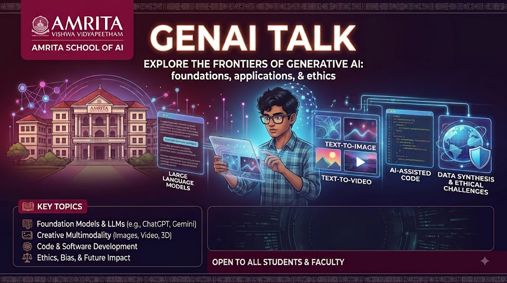
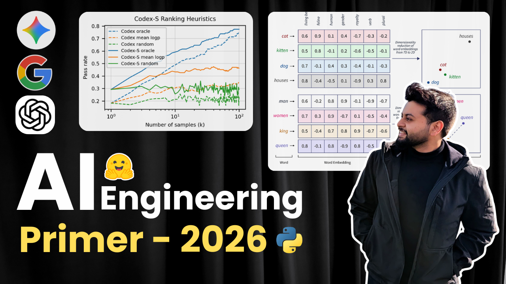

# Amrita AI - Gen AI Talk (Aug 2026)

Welcome to the repository for the **Amrita AI - Gen AI Talk** held in August 2026. This repository contains the presentation materials, scripts, and media associated with the session.



## 📁 Repository Structure

The materials are divided into sequential parts, along with supporting scripts and media:

*   **`media/`**: Contains images, graphics, and other media assets used in the talk.
*   **`scripts/`**: Contains supporting code modules and Jupyter Notebooks (comprising ~92% of the repository's code).
*   **`part-1.html` to `part-9.html`**: Exported HTML files containing the core content, presentations, or notebook exports for the talk, broken down into sequential parts (including intermediate modules like `part-1_5.html` and `part-3_5.html`).

## :arrow_forward: AI Engineering Primer 2026 - Course [YouTube]

- Watch Now: [Link](https://www.youtube.com/playlist?list=PLIYs6sQc6OTo)
- Subscribe to the channel: [Link](https://www.youtube.com/@saurav_prateek_)



## 🛠️ Languages & Tools

*   **Jupyter Notebook** (92.3%)
*   **HTML** (7.7%)

## 🚀 How to Use

To view the talk materials:
1. Clone the repository to your local machine:
   ```bash
   git clone [https://github.com/SauravP97/amrita-ai-genai-talk.git](https://github.com/SauravP97/amrita-ai-genai-talk.git)